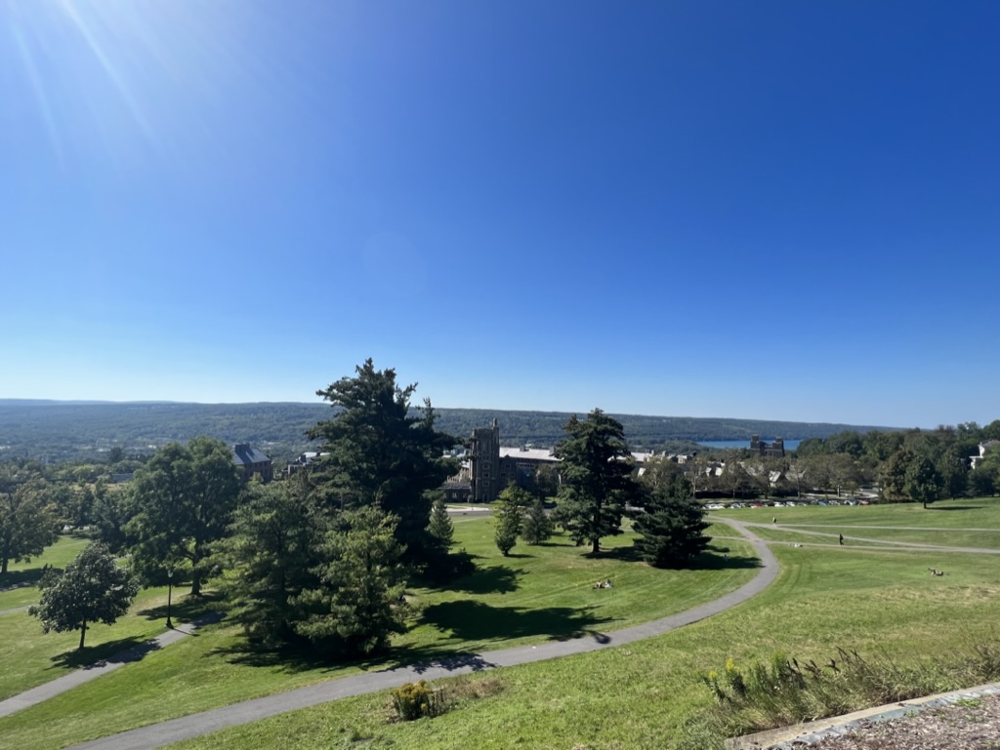
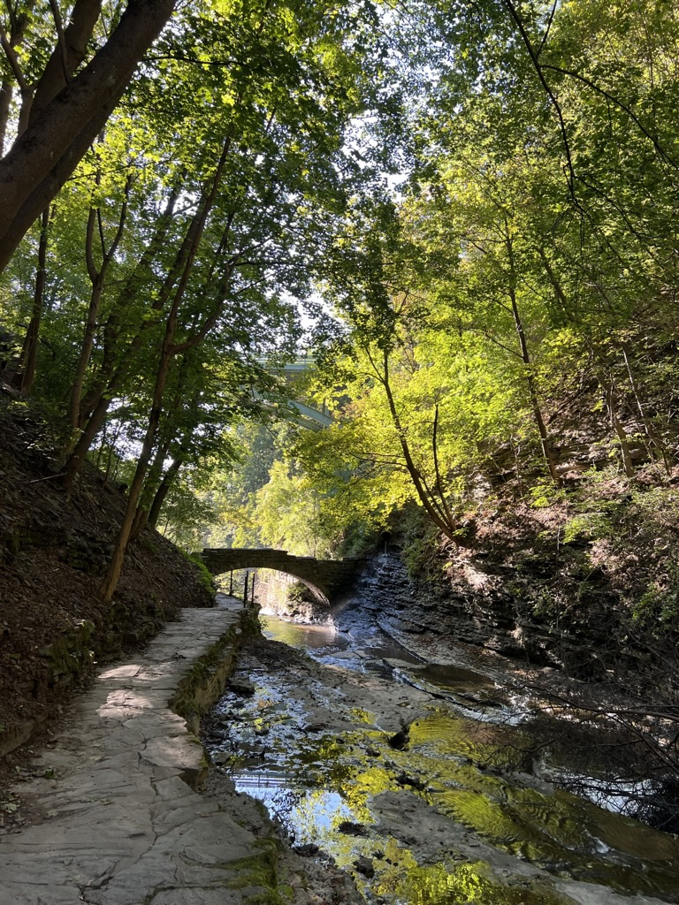
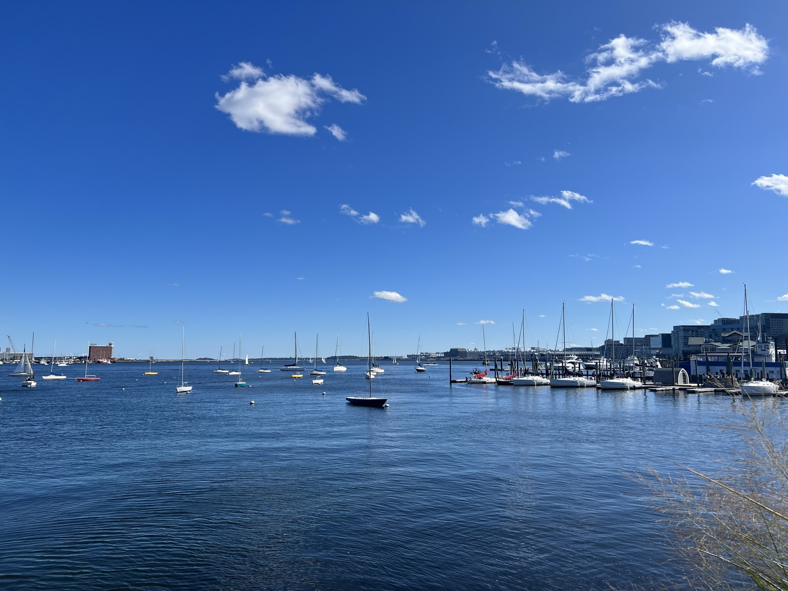
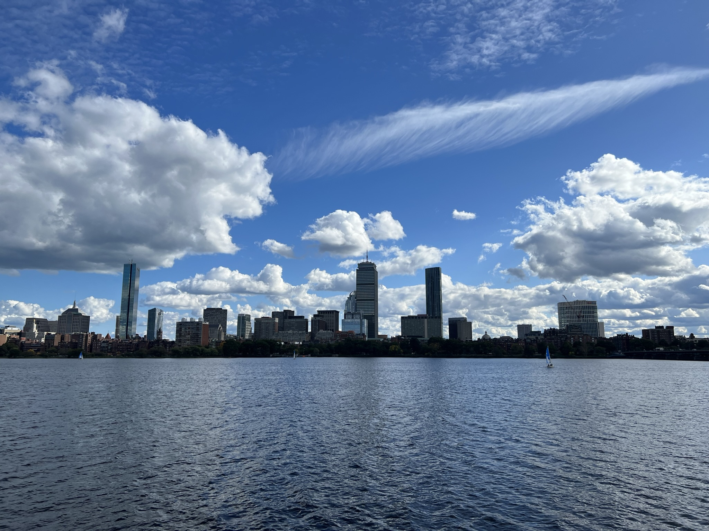
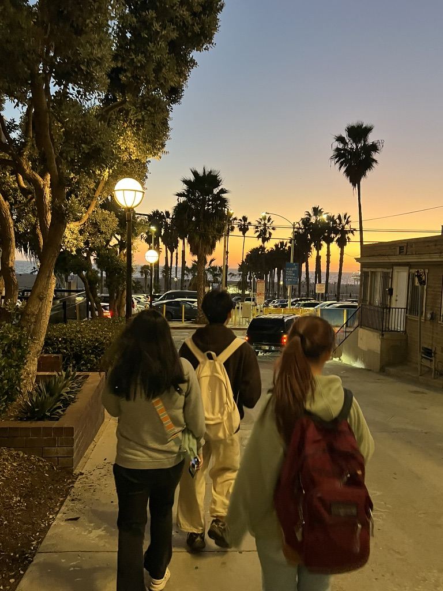
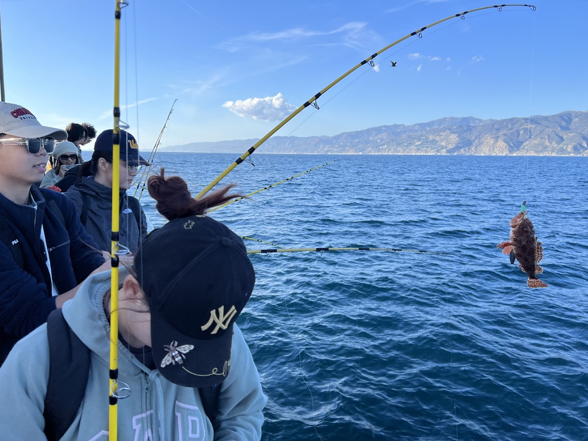
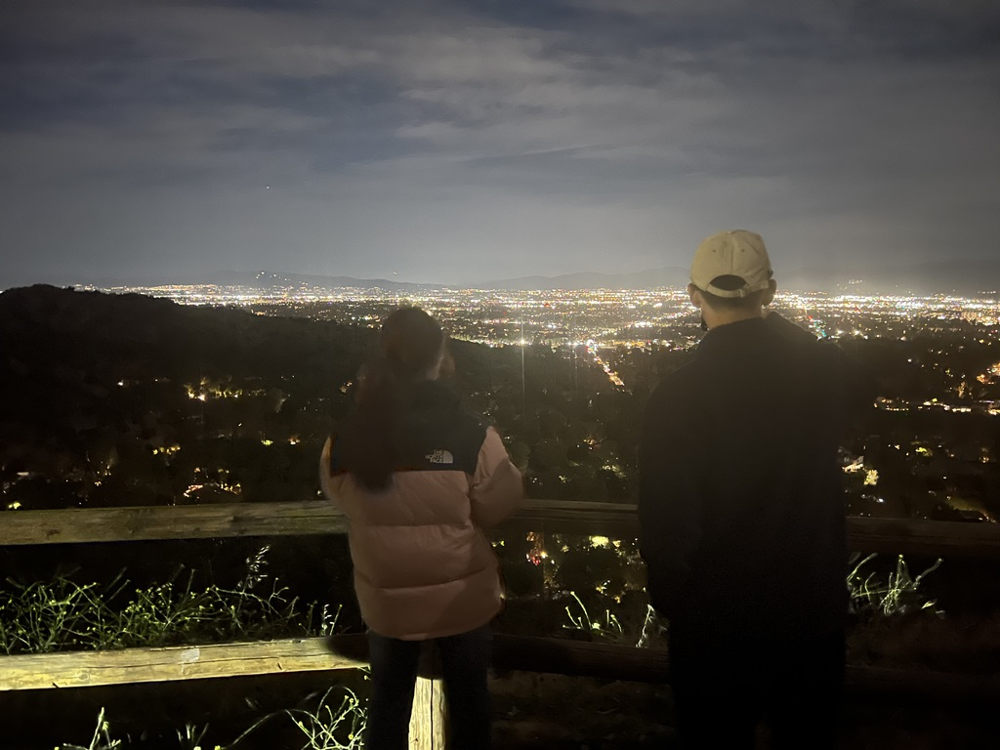
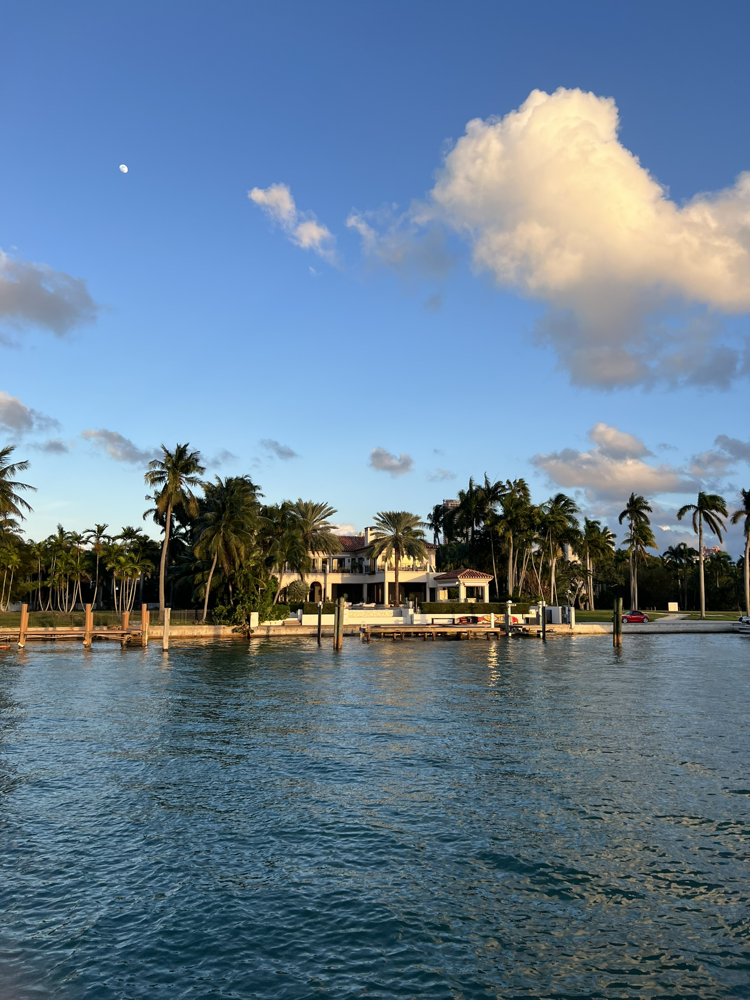
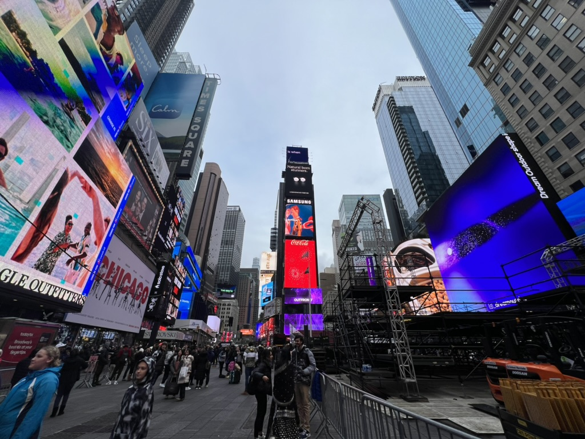
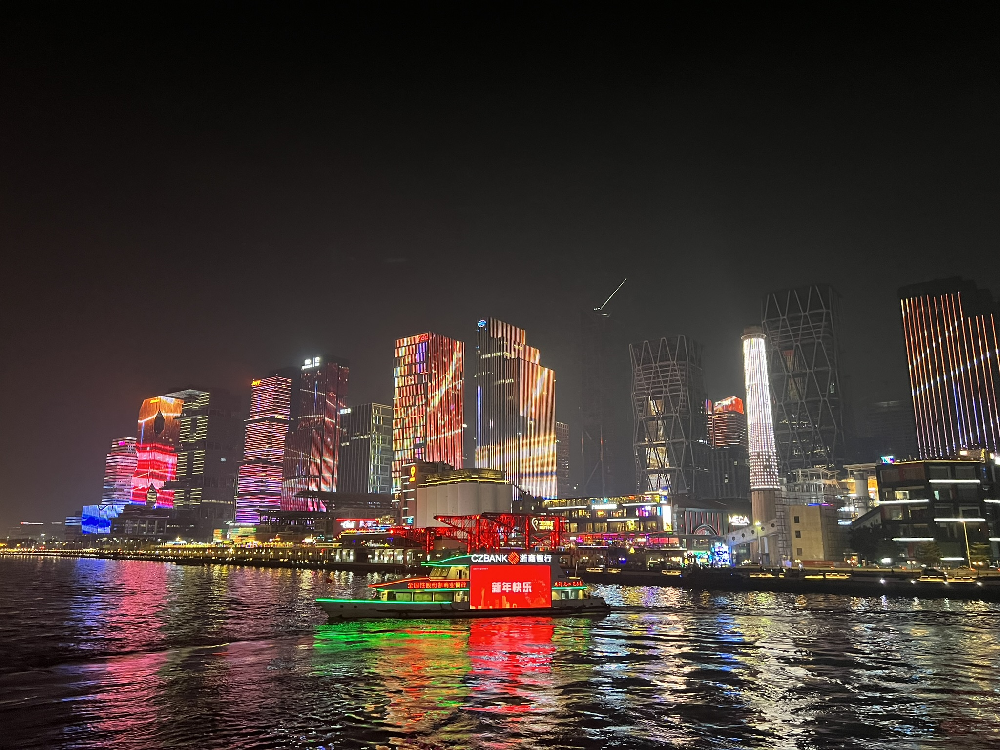

大四是倦怠的一年，不出所料地鸽了一年的学期总结。立个 flag，从这学期开始不鸽学期总结了。2023 年秋季是我来到康奈尔的第一个学期。茫茫往事似烟雾，记忆比烟更轻，情感却比水雾更浓，扣紧五指却也难以握住。遇到了很多事，想了很多很多，还是有很多搞不明白。就这样吧，成长的痛总是难以避免。

<!-- more -->

## 杂记

### 初印象

初到伊萨卡是个阴天，微湿的的空气呼吸起来很舒服，山清水秀，一派田园牧歌的风光。第一天上课刻意走了一条小路，跨过轰隆作响的瀑布上的小木桥，沿着山路拾级而上，目力所及全是翠绿色。伊萨卡的自然风光的确不错，有点世外桃源的意思。

最开始的几天总是很忙，各种讲座，Orientation，打疫苗，办手机卡、银行卡。打完疫苗之后发高烧，浑身疼，待到能爬起来时已是某天深夜，问室友要了一包方便面（也是他带过来的最后一包），简单地煮了煮。吃进嘴里的那一瞬，就像给还剩百分之五电量的手机插上充电线，“咚”的一声轻响，续上了命。倒时差也很痛苦，总是在深夜醒来，头一次感觉夜的时间如此漫长，窗外似乎多久都不会变亮。待到安定下来，已经是一个星期之后了。

Ithaca college town 有一条河，名字叫 Cascadilla Creek，景色非常好，尤其在夏末，空气不再燥热，从树荫底下可以看到透过树叶洒下来的阳光，流水和瀑布声恰到好处，不算很吵。溪水清澈见底，还可以走到缓坡的河床上，把手探进水里，感受水流的脉动。

某个周末还搭同学的汽车去了 Cayuga Lake 边的一处公园 Stewart Park 来了一次纯正的美式烧烤。等到搭好烧烤架，准备好食材，天已经黑了，湖边长着一人多高的草，隐在黑暗中摇曳。风很大，好处是完全没有蚊虫叮咬。天幕上繁星点缀，烤炉里火星飞溅。牛肉烤的太多了，吃到最后甚至有点恶心。

### 波士顿

秋假4日波士顿游，蹭朋友的车，住在朋友的亲戚家，最省钱的一集，相当于只花了吃饭的钱。

波士顿是我在美国去过的最优雅的城市，非常干净整洁，天蓝得像洗过一样。海鲜也很好吃，龙虾卷、巧达汤、生蚝、鳕鱼，太多太多了，红酒威士忌每晚畅饮，真是神仙日子。

只去了 MIT，没去成 Harvard。MIT 的建筑风格属实一般，欣赏不来。MIT 门前的 Charles River 很好看，河水透出一种黑色的冷光，看久了总有种沁人心肺的冷感，虽然气温不算低。同行的小妹说我总是会莫名其妙地盯着河水陷入沉思。澄清一下，我们 INTP 人就是这样的，我可以随时随地面对任何物体陷入沉思。

还有些事情，不愿再提，就此封存起来吧。

### 洛杉矶

最说走就走的旅行，完全没有预料到会在 Thanksgiving Break 去 LA。

LA 和 Boston 都非常好玩，气质却完全不同。如果说 Boston 的气质是优雅，那么 LA 的气质就是自由。整个城市都颇有种活力感，真是个旅游的好地方。

天文台赏月、乘船出海钓鱼、半夜开车上穆赫兰道欣赏LA夜景...，不知从何处总结起，每一天似乎都有数不清的回忆，结识了几位人很好的朋友。

钓鱼真的很好玩，终于理解为什么钓鱼佬为啥那么上瘾了。

“这座城市忽明忽暗”，很贴切。LA 的市区是扁平状的，城市的灯火宛如繁星，由于冷热气流的作用，整座城市的灯光仿佛都在闪烁。

### 佛罗里达

奥兰多3天迪士尼+环球影城。好玩是好玩，不过也只是模式化的好玩，没有太多值得记录的。

迈阿密的海滩很好看，到处都是棕榈树，如果天气好的话我可以在沙滩上躺一整天。

去 Key West 的那天下大暴雨，体验糟透了，传说中南海岸最美的风景完全没见到，天空和海水都灰沉沉的，街道仿佛都掉了色，蒙了灰。街上全是水，即便撑着伞，雨滴也把膝盖以下的裤子和鞋完全浸湿了，寸步难行，只能打车回大巴集结点。天公不作美。

再立一个 flag，之后一定要挑个阳光明媚的日子，租车自驾去 Key West 玩一圈。

### 纽约

我之于纽约，亦是匆匆过客。

时代广场，帝国大厦；浮光掠影，走马观花。

第一次坐纽约地铁就逃票，看来我已经是个成熟的 Newyorker 了。

### 广州之旅

好吃的真的多。各种街头巷尾的老店，或是装潢优雅的米其林餐厅，雅俗共赏，总有你满意的口味。在这里吃到了最好吃的榴莲酥，还有真的放在椰子壳里烤的椰子鸡，那叫一个地道。不过我个人不太爱吃肠粉。

去的那几天总有雾霾，白天拍照总是灰蒙蒙的。珠江夜景出乎我的意料，两岸的灯光秀很精彩。

## 学习

后续可能会整理一下课程 project 的视频分享出来。

+ ECE 5730 Microcontroller Design

Hunter 真是个好老师，非常有热情，深入浅出，Lab也很给力。

+ ECE 5725 Embedded Operating System

Joseph 真是个好人，讲课也就那样，听不听关系不大，不过人是真的热情。



## 找工

投了 160 多份简历，收到 3 家面试：

1. StoneX: 做金融服务业的，但不支持身份，原话：We are unable to provide an work authorization (CPT/OPT) or visa sponsorship
2. Weride: 做自动驾驶的初创公司，正在融资上市。先拿到了实习 offer，后来又加面了 1 轮（本来说是 2 轮，HR 说反馈很好，省去了 head 面）拿到了全职 offer
3. Apple: 面试发的贼晚，两轮后没有动静了

